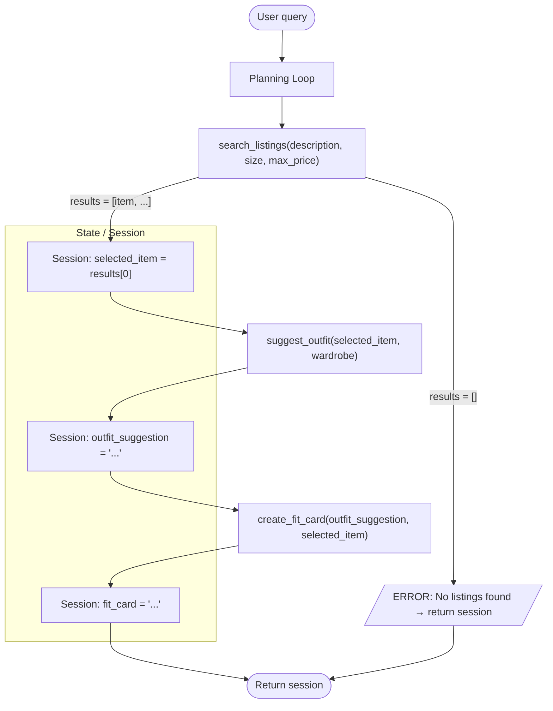

# FitFindr — planning.md

> Complete this document before writing any implementation code.
> Your spec and agent diagram are what you'll use to direct AI tools (Claude, Copilot, etc.) to generate your implementation — the more specific they are, the more useful the generated code will be.
> Your planning.md will be reviewed as part of your submission.
> Update it before starting any stretch features.

---

## Overview

FitFindr is a thrift-shopping assistant that takes a user's request (an item they want plus their style) and helps them find and style a secondhand piece. It searches a mock listings dataset for matches, suggests how to wear the top result with the user's existing wardrobe, and writes a casual caption for the find. Along the way, it can stop or adjust when no listings match, the wardrobe is empty, or an outfit suggestion is missing.

---

## Tools

List every tool your agent will use. For each tool, fill in all four fields.
You must have at least 3 tools. The three required tools are listed — add any additional tools below them.

### Tool 1: search_listings

**What it does:**
Searches the mock listings dataset for secondhand items matching the user's keywords, then optionally filters by size and price ceiling. It scores each remaining listing by keyword overlap with the description and returns the matches ranked best-first.

**Input parameters:**
- `description` (str): Keywords describing what the user is looking for, e.g. `"vintage graphic tee"`. Used for relevance scoring.
- `size` (str | None): Size string to filter by (e.g. `"M"`), matched case-insensitively (so `"M"` matches `"S/M"`). `None` skips size filtering.
- `max_price` (float | None): Maximum price (inclusive). `None` skips price filtering.

**What it returns:**
A `list[dict]` of matching listings, sorted by relevance (best match first). Each listing dict contains: `id`, `title`, `description`, `category`, `style_tags` (list), `size`, `condition`, `price` (float), `colors` (list), `brand`, and `platform`. Returns an empty list (`[]`) when nothing matches.

**What happens if it fails or returns nothing:**
It returns `[]` rather than raising an exception. The agent stops the chain here. It does not call `suggest_outfit` or `create_fit_card` or tell the user what to adjust.

---

### Tool 2: suggest_outfit

**What it does:**
Given a thrifted item and the user's wardrobe, it asks the LLM to suggest 1–2 complete outfits. When the wardrobe has items, it pairs the new item with specific named pieces; when it's empty, it gives general styling advice for the item.

**Input parameters:**
- `new_item` (dict): A listing dict (the item the user is considering buying), typically the top result from `search_listings`.
- `wardrobe` (dict): A wardrobe dict with an `items` key holding a list of wardrobe item dicts. May be empty.

**What it returns:**
A non-empty `str` containing the outfit suggestion(s). If the wardrobe is empty, the string contains general styling advice rather than references to owned pieces.

**What happens if it fails or returns nothing:**
It never returns an empty string or raises on an empty wardrobe. Instead it falls back to general styling advice. The agent passes the returned string on to `create_fit_card`.

---

### Tool 3: create_fit_card

**What it does:**
Generates a short, casual, shareable caption (like a real OOTD post) for the thrifted find. It naturally mentions the item name, price, and platform once each and captures the outfit vibe in specific terms.

**Input parameters:**
- `outfit` (str): The outfit suggestion string returned by `suggest_outfit`.
- `new_item` (dict): The listing dict for the thrifted item, used for the name, price, and platform.

**What it returns:**
A 2–4 sentence `str` usable as an Instagram/TikTok caption. A higher LLM temperature is used so different inputs produce different captions.

**What happens if it fails or returns nothing:**
If `outfit` is empty or whitespace-only, it does NOT call the LLM and returns a descriptive error message string instead of raising. The agent surfaces that message to the user rather than posting a blank caption.

---

### Additional Tools (if any)

<!-- Copy the block above for any tools beyond the required three -->

---

## Planning Loop

**How does your agent decide which tool to call next?**

The planning loop runs the three tools in a set order and checks the result of each step before deciding whether to continue. It starts by calling `search_listings(description, size, max_price)`. After it runs, the loop checks whether `results` is empty: if it is, it sets an error in the session ("No listings found...") and returns early, so `suggest_outfit` and `create_fit_card` are never called. If results came back, it stores `selected_item = results[0]` in the session and proceeds.

Next it calls `suggest_outfit(selected_item, wardrobe)` and saves the returned string as `outfit_suggestion` in the session. (This step always returns usable text, falling back to general advice when the wardrobe is empty, so it doesn't branch the loop.) Finally it calls `create_fit_card(outfit_suggestion, selected_item)` and stores the result as `fit_card`. The loop is done once `fit_card` is set or as soon as any error path sets an error message and returns the session early. The agent then returns the session, which holds whichever fields were populated.

---

## State Management

**How does information from one tool get passed to the next?**
<!-- Describe how your agent stores and accesses state within a session. What data is tracked? How is it passed between tool calls? -->

---

## Error Handling

For each tool, describe the specific failure mode you're handling and what the agent does in response.

| Tool | Failure mode | Agent response |
|------|-------------|----------------|
| search_listings | No results match the query (`[]` returned) | **Stop (hard stop).** Don't call `suggest_outfit` or `create_fit_card`. Set an error message in the session telling the user what to adjust (raise budget, loosen size, simplify keywords) and return early. |
| suggest_outfit | Wardrobe is empty (`wardrobe['items'] == []`) | **Adapt (continue).** Don't stop or error — fall back to general styling advice for the item instead of named owned pieces, return a non-empty string, and proceed to `create_fit_card`. |
| create_fit_card | Outfit input is missing or incomplete (empty/whitespace `outfit`) | **Stop (hard stop).** Don't call the LLM. Return a descriptive error string instead of a blank caption so the loop surfaces a clear message. |

---

## Architecture

<!-- Draw a diagram of your agent showing how the components connect:
     User input → Planning Loop → Tools (search_listings, suggest_outfit, create_fit_card)
                                                                          ↕
                                                                   State / Session
     Show what triggers each tool, how state flows between them, and where error paths branch off.
     Use ASCII art or a Mermaid diagram (https://mermaid.js.org/syntax/flowchart.html).
     Do NOT embed an image — graders need to read your diagram directly in the file;
     an embedded image or screenshot cannot be evaluated.
     You'll share this diagram with an AI tool when asking it to implement
     the planning loop and each individual tool. -->

## AI Tool Plan

<!-- For each part of the implementation below, describe:
     - Which AI tool you plan to use (Claude, Copilot, ChatGPT, etc.)
     - What you'll give it as input (which sections of this planning.md, your agent diagram)
     - What you expect it to produce
     - How you'll verify the output matches your spec before moving on

     "I'll use AI to help me code" is not a plan.
     "I'll give Claude my Tool 1 spec (inputs, return value, failure mode) and ask it to implement
     search_listings() using load_listings() from the data loader — then test it against 3 queries
     before trusting it" is a plan. -->

**Milestone 3: Individual tool implementations:**

I'll use Claude for the three tool functions and implement and verify them one at a time.

- **`search_listings`**
I'll give Claude the Tool 1 block from planning.md (the three typed parameters, the listing-dict return shape, and the empty-list failure mode) plus the `load_listings()` signature from [utils/data_loader.py](utils/data_loader.py). I expect it to produce a function that loads listings, filters by `max_price` and case-insensitive `size`, scores remaining listings by keyword overlap with `description`, drops zero-score items, and returns them sorted best-first. Before trusting it I'll check the code filters by all three parameters and returns `[]` (never raises) when nothing matches, then test 3 queries: one that matches several items, one with a price/size that filters everything out, and one with nonsense keywords.

- **`suggest_outfit`**
I'll give Claude the Tool 2 block (the `new_item`/`wardrobe` inputs and the empty-wardrobe fallback) and the wardrobe shape from [data/wardrobe_schema.json](data/wardrobe_schema.json). I expect a function that branches on whether `wardrobe['items']` is empty: general styling advice if empty, specific named-piece outfits otherwise, always returning a non-empty string. I'll verify it never returns `""` by testing once with a populated wardrobe and once with `{'items': []}`.

- **`create_fit_card`**
I'll give Claude the Tool 3 block (the `outfit`/`new_item` inputs, the caption style guidelines, and the empty-outfit guard). I expect a function that returns a descriptive error string when `outfit` is empty/whitespace and otherwise calls the LLM at a higher temperature for a 2–4 sentence caption. I'll verify it guards the empty case before any LLM call, then run it twice on the same item to confirm the captions differ.

**Milestone 4: Planning loop and state management:**

I'll use **Claude** for the agent loop, giving it the Planning Loop section, the State Management section, and the Mermaid Architecture diagram from planning.md, along with the finished `tools.py` function signatures. I expect it to produce a loop that calls `search_listings` → `suggest_outfit` → `create_fit_card` in order, stores `selected_item`, `outfit_suggestion`, and `fit_card` in a session object, and returns early with an error message when `search_listings` returns `[]`. Before trusting it I'll check that it stops the chain on empty search results (never calling the later tools with empty input) and that each tool reads its input from session state set by the prior step. I'll then run both interactions from the "Complete Interaction" sections — the happy path (vintage tee) and the error path (size XS leather jacket) — and confirm the session ends with the expected populated or error fields.

---

## A Complete Interaction (Step by Step)

Write out what a full user interaction looks like from start to finish — tool call by tool call. Use a specific example query.

**Example user query:** "I'm looking for a vintage graphic tee under $30. I mostly wear baggy jeans and chunky sneakers. What's out there and how would I style it?"

**Step 1:**
<!-- What does the agent do first? Which tool is called? With what input? -->
Search: search_listings("vintage graphic tee", size="M", max_price=30.0) returns 3 matching listings sorted by relevance. FitFindr picks the top result: "Faded Band Tee — $22, Depop, Good condition."

**Step 2:**
<!-- What happens next? What was returned from step 1? What tool is called now? -->
Suggest outfit: suggest_outfit(new_item=<band tee>, wardrobe=<user's wardrobe>) returns: "Pair this with your wide-leg jeans and platform Docs for a classic 90s grunge look. Roll the sleeves once and tuck the front corner slightly for shape."

**Step 3:**
<!-- Continue until the full interaction is complete -->
Fit card: create_fit_card(outfit=<suggestion>, new_item=<band tee>) returns: "thrifted this faded band tee off depop for $22 and honestly it was made for my wide-legs 🖤 full look in my stories"

**Final output to user:**
<!-- What does the user actually see at the end? -->
FitFindr shows the picked listing, the styling suggestion, and the ready-to-post fit card caption together so the user can decide whether to buy and how to wear it.

---

### A Second Interaction (Error Path)

**Example user query:** "Find me a real leather moto jacket under $40, size XS. I want something to throw over my floral dresses."

**Step 1 — Search:**
`search_listings("real leather moto jacket", size="XS", max_price=40.0)` runs first.
The price ceiling of $40 plus the strict size XS filter removes every candidate, so the keyword-scoring step has nothing left to rank. The tool returns empty list (`[]`) and it does not raise an exception.

**Error branch — search_listings returns nothing:**
The planning loop checks the result before doing anything else. Because the list is empty, it stops the chain here and does NOT call `suggest_outfit` (calling it with `new_item={}` would produce a meaningless suggestion) and does NOT call `create_fit_card`.
Instead, FitFindr explains why nothing matched and offers concrete adjustments, e.g.: "No size XS leather moto jackets came up under $40 — real leather usually runs higher. Try raising your budget to ~$60, dropping the 'real leather' requirement (faux moto jackets are common in your size), or loosening the size to XS/S."

**Hypothetical continuation if the user loosens the query:**

**Step 2 — Suggest outfit (empty-wardrobe sub-case):**
Suppose the user retries with `max_price=60.0` and one jacket now matches, but their wardrobe file has no items yet (`wardrobe['items'] == []`).
`suggest_outfit(new_item=<moto jacket>, wardrobe=<empty>)` detects the empty wardrobe and, instead of failing, returns general styling advice ("A black moto jacket layers over almost anything; try it open over a floral midi dress with ankle boots…") rather than naming specific owned pieces.

**Step 3 — Fit card (incomplete-input guard):**
If `suggest_outfit` had instead returned an empty/whitespace string, `create_fit_card(outfit="", new_item=<moto jacket>)` would not call the LLM. It returns a descriptive error string ("Can't write a fit card without an outfit suggestion") so the loop can surface a clear message instead of posting a blank caption.

**Summary of which error triggers which response:**

| Where it breaks | Trigger | What FitFindr does |
|-----------------|---------|--------------------|
| `search_listings` | Returns `[]` (no listing passes the size/price/keyword filters) | Stop the chain, skip `suggest_outfit` and `create_fit_card`, tell the user what to change |
| `suggest_outfit` | `wardrobe['items']` is empty | Don't fail, return general styling advice for the item instead of named-piece outfits |
| `create_fit_card` | `outfit` is empty or whitespace-only | Don't call the LLM — return a descriptive error string instead of a blank caption |
